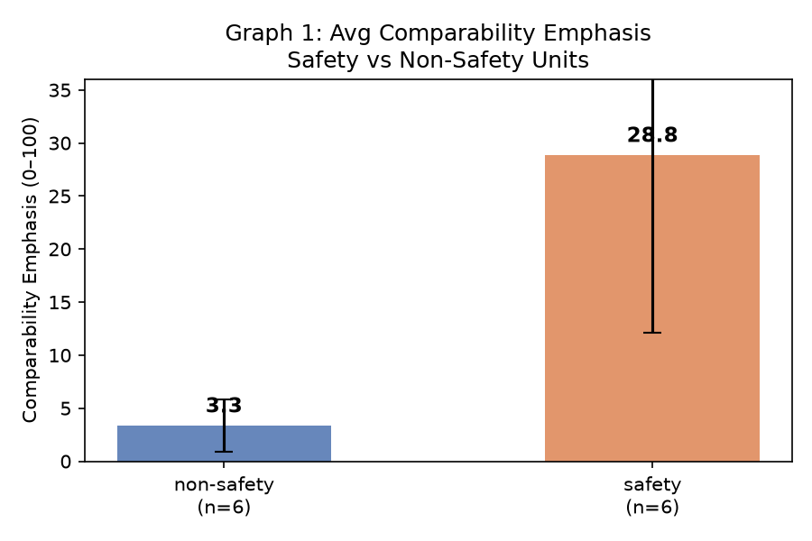
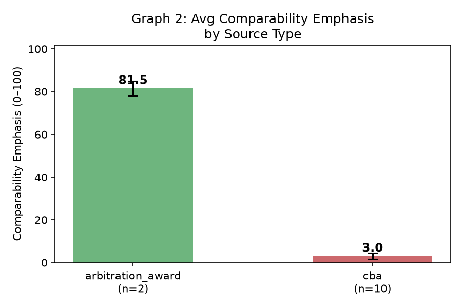
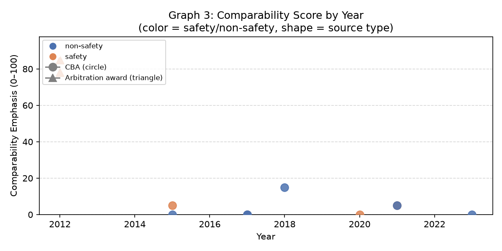

# GABRIEL Pilot — v3 Report
**Attribute:** comparability_emphasis  
**Run date:** 2026-06-18  
**Model:** gpt-5.4-nano (Harvard HUIT OpenAI proxy)  
**Endpoint:** https://go.apis.huit.harvard.edu/ais-openai-direct/v2  
**Tokens used:** 235,995 prompt + 785 completion = 236,780 total (~$0.036)

---

## Attribute Definition

**Name:** comparability_emphasis

**Plain-English description:** Measures how heavily a document relies on wage comparisons to other municipalities or bargaining units to justify its own wage terms. High scores indicate the document explicitly names peer cities/units and uses their wages as the primary justification for the award or contract's terms. Low scores indicate the document sets wages without referencing external comparisons.

**Score bands:**

| Band | Meaning |
|------|---------|
| 0–15 | No comparability language present anywhere in the document |
| 16–40 | Comparability mentioned in passing, not used to justify specific figures |
| 41–70 | Comparability explicitly used to justify at least one specific wage figure or increase |
| 71–100 | Comparability is the primary justification, with named peer-city examples cited |

---

## v1 / v2 / v3 Comparison

| Version | Model | Truncation | Score range | Safety mean | Non-safety mean | arbitration_award mean | cba mean |
|---------|-------|------------|-------------|-------------|-----------------|------------------------|----------|
| v1 | gpt-4o-mini | 12,000 chars | 10–20 | 16.7 | 13.3 | 15.0 | 14.3 |
| v2 | gpt-5.4-nano | 12,000 chars | 0–10 | 0.8 | 2.5 | 2.5 | 1.5 |
| v3 | gpt-5.4-nano | 300,000 chars | 0–85 | 28.8 | 3.3 | 81.5 | 3.0 |

---

## Figures

### Figure 1: Average Comparability Emphasis by Occupation Type

**Caption:** Average comparability emphasis score by occupation type (safety = police/fire; non-safety = clerical, DPW, public works). Tests whether safety units use more comparability language than comparison units. In v3, safety mean = 28.8 vs. non-safety mean = 3.3, but this gap is driven entirely by the two Somerville arbitration awards. n=12 — below statistical significance threshold; treat as pipeline validation only, not a finding.

---

### Figure 2: Average Comparability Emphasis by Document Type

**Caption:** Average comparability emphasis score by document type (arbitration awards vs. CBAs/MOAs). Tests whether arbitration awards — where an arbitrator writes explicit reasoning — score higher than negotiated contracts where comparability rationale may not appear in writing. In v3, arbitration_award mean = 81.5 (n=2) vs. cba mean = 3.0 (n=10). This gap is the most interpretable signal in the pilot: arbitrators are required to justify their awards, so comparability reasoning appears in the text; CBA/MOA documents contain the agreed terms but not the negotiating rationale. n=12 — exploratory only.

---

### Figure 3: Comparability Emphasis Score by Document Year

**Caption:** Comparability emphasis score by document year, colored by safety/non-safety and shaped by source type (circle = CBA/MOA, triangle = arbitration award). Shows score distribution across the 2012–2024 observation window. The two high-scoring documents are the Somerville police arbitration awards from 2012. n=12 — no temporal trend should be inferred at this sample size.

---

## Summary

### What this pilot run was for

This is a pipeline validation run, not a substantive finding. The goal is to confirm that GABRIEL's `comparability_emphasis` attribute — the coding rule, prompt, and scoring pipeline — produces scores that are internally coherent and respond to text features in the expected direction. The 12 documents cover five Massachusetts cities (Worcester, Boston, Somerville, Arlington, Newton), four occupation classes (fire, police, clerical_admin, public_works), and two document types (CBA/MOA, arbitration award). The sample is too small for statistical inference; its purpose is to stress-test the measurement instrument.

### The v1 → v2 → v3 progression

**v1** used `gpt-4o-mini` by error (the intended model was `gpt-5.4-nano`). Because `gpt-4o-mini` does not have constrained reasoning-effort mode, it received the prompt as a standard chat call. It produced round-number scores clustering at 10 and 20 (score range 10–20), with effectively no spread between safety and non-safety units and no spread between document types. This is the signature of a model that is anchoring on round numbers rather than reading the text carefully.

**v2** switched to the correct model (`gpt-5.4-nano`, `reasoning_effort=low`) but retained the 12,000-character truncation limit. The score range collapsed to 0–10, with everything near the floor. The truncation is the likely culprit: the two Somerville police arbitration awards are 232K and 256K characters; at 12K chars, the model is reading only the first few pages of each document, which contain procedural boilerplate (parties, submission, stipulated facts) rather than the comparability analysis that appears later in the text. Near-floor scores on documents that should score high are the signature of a truncation bug, not a true floor.

**v3** raised the truncation limit to 300,000 characters (covering all 12 documents in full) and ran on the Harvard HUIT OpenAI proxy. Score range: 0–85. The two Somerville police arbitration awards scored 78 and 85 — correctly the highest-scoring documents in the batch, since both contain extended sections explicitly comparing Somerville police wages to named peer communities (Arlington, Brookline, Cambridge, Lowell) to justify the arbitration award. The remaining 10 documents (all CBAs/MOAs) score 0–15, which is also correct: CBA/MOA text contains the agreed wage schedules but not the comparability rationale that drove the negotiation.

### Reading the v3 results honestly

V3 shows real score variation. The arbitration_award mean (81.5) is sharply separated from the cba mean (3.0), and that separation is substantively interpretable: interest arbitration is a quasi-adjudicative process in which the arbitrator must write a reasoned award, and Massachusetts arbitrators routinely use comparability to justify their decisions. Negotiated CBAs typically record the outcome without the reasoning. This is a feature of the document type, not a measurement artifact.

The safety vs. non-safety gap in v3 (safety mean 28.8 vs. non-safety 3.3) is real but driven entirely by the two arbitration awards in the safety group. There are zero arbitration awards in the non-safety sample. Interpreting the safety/non-safety gap would require either (a) obtaining non-safety arbitration awards for comparison, or (b) restricting the comparison to CBAs only (where both groups score near zero). Andrei should weigh in on whether the CBA-only comparison or the full-corpus comparison is the right specification for the paper.

**What each outcome means going forward:**

- *If v3 shows real variation* (which it does): the pipeline is working. The attribute successfully distinguishes between document types with different institutional requirements for stating comparability rationale. The next step is to scale to more documents — particularly JLMC arbitration awards from other Massachusetts cities — to test whether the arbitration_award vs. CBA gap holds across a larger sample and whether there is cross-city variation within arbitration awards.

- *If v3 had remained flat*: the likely explanation would be that comparability language is genuinely sparse in this document set, which would itself be a candidate finding — either that Massachusetts public-sector contracts rarely cite comparability in writing, or that the attribute needs to be redefined to capture implicit comparability signals (e.g., wage schedules that replicate peer cities' numbers without naming them).

### What the next real GABRIEL run needs

1. **More documents.** The 12-document pilot cannot support inference. The minimum useful sample for the safety/non-safety comparison is 30–50 matched pairs across 10+ cities. Priority sources: JLMC arbitration awards (manual download from the JLMC database, which is not programmatically accessible), and remaining matched-pair completions for cities currently missing a comparison unit (see `data/city_coverage.csv`).

2. **Arbitration awards in the non-safety group.** The current sample has no non-safety arbitration awards. Adding teacher or clerical arbitration awards from the same cities as the safety awards would enable a clean document-type-controlled comparison.

3. **Scale to other states.** Massachusetts JLMC is the most tractable starting point, but the cross-state comparison (states with mandatory arbitration vs. states without) is the paper's headline design. Pennsylvania PLRB, New York PERB, and Michigan MERC are the next targets.

4. **Attribution check.** Before scaling, run a 5-document spot check where the GABRIEL score and the document text are reviewed side-by-side. The v3 scores look coherent, but the arbitration awards are the only truly high-scoring documents; confirming the score is tracking the right text features — not length or document complexity — before committing to a large batch is good practice.
