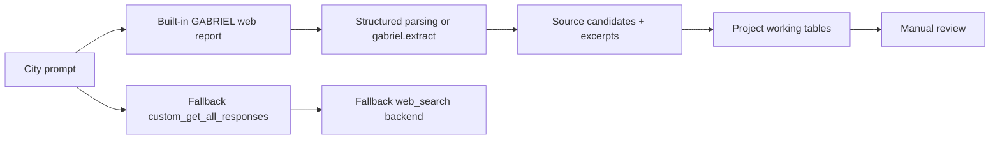

# City-by-City Public-Source Discovery and Extraction with GABRIEL Web Mode

**Date:** 2026-07-01  
**Status:** Thursday-facing draft updated after the Boston graduated built-in web retry

## 1. Executive summary

- The project goal remains narrow: use GABRIEL to help discover public municipal labor sources and produce small working extraction artifacts for later manual review.
- The seed scaffold is ready: 5 city responses, 15 source rows, and 34 extraction rows from the existing calibration harness.
- `openai-gabriel` is installed and imported locally at version `1.1.8`.
- The built-in web path is confirmed as callable through `gabriel.whatever(..., web_search=True)`.
- A larger Boston structured prompt failed with connection errors.
- Minimal diagnostics all succeeded.
- A graduated Boston-only retry succeeded on attempt 2 and returned one parseable source URL for the BPS `BTU Contract Negotiations` page.
- No ingestion happened, no production data was created, and no additional live calls were run in this report-integration session.

## 2. Correct Thursday framing

The live finding is no longer blocked.

The correct Thursday message is:

> Built-in GABRIEL web mode works on a bounded Boston source-discovery query through the Harvard proxy, but larger structured extraction prompts need incremental tuning for stability.

This is still an acquisition/extraction assistance workflow. It is not production measurement, not automatic ingestion, and not a basis for causal claims.

## 3. What we built

- A built-in-first GABRIEL web workflow centered on `gabriel.whatever(..., web_search=True)`.
- A fallback `custom_get_all_responses(...)` scaffold for tighter schema control if needed later.
- Two working tables upstream of ingestion decisions:
  - source discovery;
  - evidence extraction.
- A five-city seed harness for Boston, Somerville, Newton, Wayland, and Seekonk.

## 4. Current status table

| Stage | Result | Interpretation |
| --- | --- | --- |
| Seed scaffold | 5 city responses, 15 source rows, 34 extraction rows | schema and calibration harness ready |
| Package install | `openai-gabriel` 1.1.8 installed/imported | built-in GABRIEL available |
| Large Boston prompt | connection errors | too large or unstable request shape |
| Minimal diagnostics | all succeeded | proxy/web basics work |
| Graduated Boston retry | attempt 2 succeeded | built-in web source discovery works when bounded |

## 5. Boston graduated retry result

The bounded Boston retry was intentionally small and stopped at the first useful success:

| Attempt | Result |
| --- | --- |
| 1 | failed with a connection error |
| 2 | succeeded with one parseable source URL |
| 3 | skipped after prior success |

Observed working outputs:

- source rows: 1
- extraction rows: 1
- returned source: BPS `BTU Contract Negotiations`
- URL preserved: yes
- Boston BTU/BPS material rediscovered: yes
- ingestion: no

The working extraction row is a concise retry artifact only. It is not a verbatim source-page extraction and was not ingested into production tables.

## 6. Interpretation

The practical conclusion is narrower than “full structured extraction works” and stronger than “web mode is blocked.”

- Built-in GABRIEL web mode can return a useful Boston public-source lead through the Harvard proxy when the prompt is bounded.
- The failure mode appears tied to request shape, size, or transient instability rather than a blanket proxy or package failure.
- Larger structured extraction prompts should be tuned one dimension at a time before any broader pilot.

## 7. Recommended next technical step

Boston-only structured extraction tuning, one dimension at a time:

1. prompt size
2. output cap
3. source metadata handling
4. timeout behavior

Do not run a five-city live pilot or all-32 v10 until a small Boston structured-output path is stable.

## 8. Guardrails

- No live web search was run for this report-integration session.
- No GABRIEL model/API calls were run for this report-integration session.
- No ingestion happened.
- No modifications were made to `data/contracts.csv`, `data/city_coverage.csv`, `corpus/`, or `inbox/`.
- No PDF or slide deck was created in this session.
- No PRRs are recommended here.
- No causal claims are made here.

## 9. Pipeline diagram

## 10. Bottom line

Thursday’s update should say that the built-in GABRIEL web path is operational for bounded Boston source discovery in this environment. The remaining technical task is not “get any result at all”; it is “stabilize small structured Boston extraction before broadening scope.”
