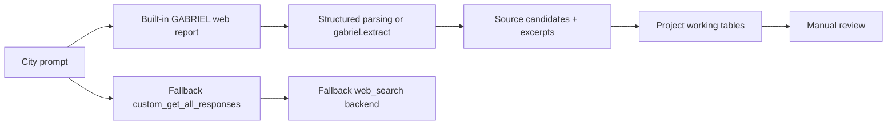

# City-by-City Public-Source Discovery and Extraction with GABRIEL Web Mode

**Date:** 2026-07-01  
**Status:** Thursday-facing draft; framework corrected after tutorial clarification; built-in web smoke test blocked locally by missing package

## 1. Executive summary

- The tutorial clarification indicates that built-in GABRIEL web mode should be the primary live path for this project.
- In practice, that means starting with built-in web-researched city reports rather than starting with a custom callback.
- This repo had not yet wired built-in GABRIEL web mode into the project's city-by-city source and extraction schema.
- We therefore built a custom `get_all_responses_fn` scaffold, `custom_get_all_responses`, as a fallback and advanced schema-control path.
- The scaffold currently runs in seed/dry-run mode only; no live web search was executed and no ingestion was performed.
- A Boston-only built-in web smoke test was attempted at the environment-check stage, but the `gabriel` Python package was not installed or vendored locally, so no live run was executed.
- The intended use remains acquisition and extraction assistance for later manual review, not production measurement, not automated ingestion, and not causal inference.

### What we built

- A corrected framework that treats built-in GABRIEL web mode as the first live test path.
- A custom GABRIEL callback scaffold through `custom_get_all_responses` as fallback/advanced infrastructure.
- A proposed fallback live `web_search` backend contract with bounded, adapter-friendly inputs and outputs.
- A five-city seed harness covering Boston, Somerville, Newton, Wayland, and Seekonk.
- Two working output schemas: source discovery and evidence extraction.
- No live search and no ingestion yet.

### What this is / what this is not

- This is an acquisition/extraction assistant framework.
- This is not production measurement.
- This is not automatic ingestion.
- This is not causal evidence.
- This is not broad scraping.

## 2. Motivation

For the police/fire wage project, a central operational bottleneck is finding public, reasoning-rich municipal labor sources city by city. Final CBAs are often easier to locate than the documents that explain why wages moved: arbitration awards, JLMC materials, bargaining packets, mediation proposals, committee presentations, and union summaries.

That bottleneck matters because the project is trying to recover wage-setting mechanisms rather than simply stockpile contracts. A bounded GABRIEL web workflow could help discover candidate sources, classify them into the correct corpus lane, and extract short structured evidence before any later manual ingestion decision.

The value proposition is therefore upstream of production measurement. The framework is meant to assist acquisition and evidence triage, not to substitute for provenance review or the existing ingestion pipeline.

## 3. Revised framing after reading the tutorial

The tutorial clarification changes the recommended live path:

- built-in GABRIEL web mode should be treated as the first-choice live mechanism;
- custom `get_all_responses_fn` should be treated as an advanced fallback, not the default route;
- city-specific domain filters and schema targets still matter, but they should be tested first through built-in web mode;
- the immediate technical question is not whether a custom callback can be written, but how built-in web mode should be invoked and what output structure it returns in this project environment.

For this project, the most natural first live sequence is:

1. generate city-level web reports with built-in GABRIEL web search;
2. extract structured source/excerpt fields from those reports with `gabriel.extract` or a structured parser;
3. fall back to a custom callback only if tighter schema control is required.

## 4. What the toolkit creator asked us to test

The Thursday task was not generic search. It was a specific test of whether GABRIEL could support a Massachusetts city-by-city workflow that does all of the following in one bounded pass:

- discover public sources by city;
- pull multiple structured attributes for each retained source;
- extract short evidence from sources, not just URLs;
- support search/discovery, source classification, and evidence extraction together.

In other words, the question was whether GABRIEL could act as a small acquisition-and-extraction assistant rather than only a scorer over already-local text.

## 5. What we found locally

Local inspection pointed to a practical gap in this repo setup:

- no project-specific invocation of built-in GABRIEL web mode was already wired into the city-by-city workflow;
- the existing local runners score already assembled text inputs and write results;
- the `ingest/fetchers/` layer is source-specific scaffolding for open portals, not a generic GABRIEL search interface;
- no local helper yet mapped built-in web outputs into the project's source and extraction working tables.

That did **not** mean built-in web mode was unavailable in principle. It meant this repo had not yet connected the tutorial's built-in web path to the project's city-by-city schema. The custom callback scaffold was therefore useful as a fallback and as a way to preserve schema discipline while the built-in path remained unconfirmed in this environment.

## 6. Built-in live path to confirm in this environment

The tutorial suggests the live path should be tested in this order:

- `gabriel.whatever(..., web_search=True)` to generate city web reports;
- `web_search_filters` to constrain city/domain scope;
- `search_context_size` to tune how much retrieved context is included;
- `gabriel.extract` or structured parsing on report outputs to recover the project fields we care about.

The open operational question is therefore:

`we need to confirm exact invocation details and output structure for built-in web mode in this project environment.`

## 7. Custom callback design as fallback/advanced path

The implemented hook is:

```python
custom_get_all_responses(
    prompts,
    identifiers,
    json_mode=False,
    model=None,
    api_key=None,
    web_search=None,
    **kwargs,
)
```

The design goal was narrow compatibility and schema control. The function accepts a batch of prompts and identifiers, resolves each city, and returns a pandas dataframe with exactly two columns:

- `Identifier`
- `Response`

`Response` is always a parseable JSON string. That is true even if `json_mode=False`, because the downstream requirement here is reliable flattening and auditability, not multiple response modes.

In seed/dry-run mode, the callback reads the existing five-city seed source and extraction CSVs, packages the city-level results into JSON payloads, and returns one payload per city. Each payload also carries:

- `status`
- `error_type`
- `error_message`
- `source_candidates`
- `extractions`
- `web_search_contract`
- `search_config`
- `notes`

This makes the callback self-describing enough for a Thursday discussion without requiring anyone to read the implementation first.

The important reframing is that this scaffold is now best understood as:

- a useful fallback if built-in web outputs are not structured enough;
- a useful schema-enforcement layer if the project needs deterministic source/extraction rows;
- a useful advanced hook if a nonstandard backend is required;
- not the first-choice live search mechanism.

### Worked example payload

Below is the short form of one seeded Boston response. It shows the shape of the callback output without pasting the full payload.

```json
{
  "Identifier": "gabriel_websearch_city_boston_2026_06_30",
  "city": "Boston",
  "status": "seed_dry_run",
  "source_candidates_count": 3,
  "extractions_count": 7,
  "example_source_candidate": {
    "source_title": "BTU contract negotiations page",
    "source_url": "https://www.bostonpublicschools.org/school-committee/btu-contract-negotiations",
    "document_type_guess": "bargaining_update",
    "source_corpus_recommendation": "mechanism_proxy",
    "comparability_signal": "high"
  },
  "example_extraction": {
    "attribute": "comparability_emphasis",
    "attribute_signal": "high",
    "short_verbatim_excerpt": "Minimum and Maximum Teacher Salary with a Masters Comparisons to Surrounding Districts",
    "ingestion_recommendation": "add_to_mechanism_queue"
  },
  "notes": [
    "Seeded from existing calibration CSVs; live web search was not executed.",
    "Response is always a parseable JSON string regardless of json_mode."
  ]
}
```

## 8. Proposed fallback live web-search backend contract

The scaffold assumes a deliberately small backend contract:

```python
web_search(
    query: str,
    *,
    max_results: int = 5,
    domains: list[str] | None = None,
    city: str | None = None,
    state: str | None = None,
) -> list[dict]
```

Expected result keys:

- `title`
- `url`
- `snippet`
- `source_domain`
- `published_date`
- `retrieval_status`

This contract is intentionally minimal and adapter-friendly. It does not assume a specific search vendor, ranking protocol, or page-fetch model. It only assumes that a backend can return a bounded list of source candidates with enough provenance to support retention decisions and later extraction.

That minimalism is deliberate for three reasons:

1. It keeps the integration surface small.
2. It preserves URLs and citation-bearing metadata from the start.
3. It avoids coupling the callback to any one backend's richer but potentially unstable object shape.

This contract should now be treated as a fallback adapter design, not as the primary interpretation of GABRIEL web search.

## 9. Pipeline diagram



## 10. Design choices made independently

These choices were made conservatively to optimize for auditability, token efficiency, provenance, city-by-city scaling, and no accidental ingestion.

| Design choice | Decision | Reason |
| --- | --- | --- |
| built-in path | Treat built-in GABRIEL web mode as the primary live path | Aligns with the tutorial and avoids replacing the full prompt-processing stack too early |
| backend contract | Small `web_search(query, *, max_results, domains, city, state) -> list[dict]` fallback contract | Keeps the fallback adapter surface narrow and avoids hard-coding a vendor-specific response schema |
| returned search fields | `title`, `url`, `snippet`, `source_domain`, `published_date`, `retrieval_status` | Preserves enough discovery metadata for ranking, provenance, and later review without over-assuming backend richness |
| domain filters | Exposed per city and treated as hard preferences | Prioritizes official municipal, school, union, and state sources and reduces noisy search spread |
| result caps | Bounded queries, results, retained sources, and extractions | Controls token use and makes city-by-city review feasible |
| extraction path | Prefer built-in report output plus `gabriel.extract` or structured parsing | Uses the tutorial-default route before custom plumbing |
| always JSON response | Yes in the fallback scaffold | Ensures reliable flattening back into tables and avoids mixed response formats |
| no streaming | Yes in the fallback scaffold | The current hook boundary returns a complete dataframe; partial transport is unnecessary for the seed demo |
| citation/source URL preservation | Preserve URLs and snippets in payloads | Prevents detached evidence and keeps source provenance inspectable |
| corpus-lane separation | Keep causal, mechanism-proxy, discourse, and lead-only distinct | Avoids accidental ingestion logic and protects the repo's two-corpus discipline |

## 11. Source and extraction schema

The framework is built around two compact outputs:

- a source-discovery CSV for retained candidates;
- an evidence-extraction CSV for short structured observations from those candidates.

| Artifact | Purpose | Unit of observation | Key columns | Use |
| --- | --- | --- | --- | --- |
| source-discovery CSV | Retain and classify public source candidates | one retained source candidate | `city`, `query`, `source_title`, `source_url`, `document_type_guess`, `source_corpus_recommendation`, `download_or_ingest_recommendation` | Acquisition triage, corpus-lane classification, later manual follow-up |
| evidence-extraction CSV | Record short source-level evidence on mechanism attributes | one extracted attribute observation | `city`, `source_title`, `attribute`, `attribute_signal`, `short_verbatim_excerpt`, `ingestion_recommendation` | Calibration, attribute testing, manual evidence review before any ingestion task |

The important design point is that these are not production corpus tables. They are search-and-extraction working tables that sit upstream of manual ingestion decisions.

## 12. Five-city seed demo

The current seed demo uses existing materials only. It is a dry-run harness, not a live search pilot.

- Cities: Boston, Somerville, Newton, Wayland, Seekonk
- City responses: 5
- Source candidates: 15
- Extraction rows: 34
- Live search executed: no
- Ingestion performed: no

| City | Source rows | Extraction rows | Calibration role |
| --- | ---: | ---: | --- |
| Boston | 3 | 7 | Non-safety peer-wage mechanism-proxy check |
| Somerville | 3 | 8 | Safety arbitration/JLMC positive calibration |
| Newton | 3 | 7 | Mediation and MOA edge-case review |
| Wayland | 3 | 6 | JLMC positive plus grievance-arbitration exclusion |
| Seekonk | 3 | 6 | Clean official archive ingestability check |

## 13. Calibration examples

- Boston BTU: useful non-safety peer-wage mechanism-proxy example with high comparability and named comparator signal; not v10 impasse evidence.
- Somerville police awards: clear safety-side calibration positives for arbitration/JLMC and comparability.
- Wayland fire JLMC: positive impasse/arbitration pathway example through a stipulated award.
- Seekonk official CBA archive: clean official-source ingestability example and a useful ordinary CBA comparison case.
- Newton materials: mostly mechanism-proxy or manual-review leads rather than clean final causal documents.

These examples are useful because they define both positive cases and exclusion boundaries before any live test.

## 14. Multiple attributes extracted

- `comparability_emphasis`: whether the source explicitly compares wages or compensation to peer jurisdictions; this matters because comparability is the main candidate ratchet mechanism.
- `arbitration_or_impasse_backstop`: whether the source shows formal impasse-resolution institutions shaping settlement; this matters because safety wage-setting may depend on stronger backstop institutions.
- `wage_reasoning_density`: whether the source explains why wages changed rather than only listing terms; this matters because reasoning-rich documents are more analytically valuable than bare agreements.
- `named_comparator_signal`: whether the source names specific comparator cities or districts; this matters because named peers are stronger mechanism evidence than generic market language.
- `source_ingestability`: whether the source is a clean public final document that could later enter the causal pipeline; this matters because many useful search leads are still not ingestion-ready.

## 15. Guardrails

The framework is intentionally constrained.

- No automatic ingestion.
- No PRRs.
- No paywalled or licensed sources.
- No broad scraping.
- No causal claims.
- No merging mechanism-proxy or discourse leads into the causal corpus.
- No treating ordinary grievance arbitration as impasse evidence.
- No treating peer-wage comparison alone as arbitration/impasse evidence.

Those guardrails matter because the acquisition layer should widen source visibility without collapsing the repo's provenance and corpus-separation discipline.

## 16. Built-in web-mode fit questions for Thursday

The main open questions are now about built-in web-mode invocation and output shape in this project environment. If the built-in path is close to what the project needs, the likely outcome is a thin report-to-schema adapter rather than a custom backend design.

- What is the exact built-in invocation pattern for city-level web reports in this environment?
- What output structure does built-in web mode actually return?
- Can built-in outputs preserve citations and source URLs cleanly enough for the project's working tables?
- Are `web_search_filters` sufficient for city/domain control?
- How much does `search_context_size` affect report usefulness for later extraction?
- Should the project use `gabriel.extract` directly on built-in reports or do lightweight structured parsing first?
- At what point would schema-control needs justify falling back to `get_all_responses_fn`?

The scaffold still demonstrates a workable fallback integration shape. Thursday should help determine whether the built-in path is already enough and where a thin adapter would be useful.

## 17. Optional live smoke test

A one-city Boston live smoke test was considered for this report, but it was not executed. The corrected next step is to test built-in GABRIEL web mode first, not to start with the custom callback. No live search was run in this session.

The report therefore remains seed-mode only. The immediate need is to confirm exact invocation details and output structure for built-in web mode in this project environment. No ingestion was performed.

## 18. Built-in GABRIEL web smoke test

The Boston-only built-in smoke test was stopped before any live call because built-in GABRIEL web mode was not available in this Python environment.

- Scope checked: Boston, MA only; intended identifier `gabriel_builtin_web_boston_btu_2026_07_01`.
- Intended target: public BPS/BTU salary-comparison and contract-negotiation sources.
- Package check: `import gabriel` failed; `python -m pip show gabriel GABRIEL gabriel-toolkit gabriel-ai` found no installed package.
- Local package/notebook check: no vendored GABRIEL package or uploaded tutorial notebook was found locally.
- Functions unavailable here: `gabriel.whatever`, `gabriel.extract`, `gabriel.rate`, and `gabriel.classify`; related web arguments could not be tested.
- Source rows created: 0.
- Extraction rows created: 0.
- Boston BTU rediscovered: no, because no live search ran.
- URLs/citations preserved: none returned, because no live search ran.
- Ingestion: no.

This preserves the corrected framework: built-in GABRIEL web mode remains the primary path, but it has not yet been successfully run in this environment. The issue to resolve with Hemanth/toolkit creator is package/environment availability first, then the exact invocation shape.

## 19. Revised live path after reading the tutorial

- primary path: `gabriel.whatever(..., web_search=True)` to generate city web reports;
- extraction path: `gabriel.extract` or structured parsing on those reports;
- fallback path: custom `get_all_responses_fn` only if project-specific schema control is needed.

## 20. Next live-test plan

If built-in web mode is callable in this environment, the first live test should remain tightly bounded:

- start with Boston only;
- keep city/domain filters on through the built-in control surface;
- confirm report output structure before broadening scope;
- if the built-in path is adequate, then reuse the same five cities;
- keep domain filters on;
- run at most six queries per city;
- return at most five results per query;
- retain at most ten sources per city;
- extract at most three spans per source;
- compare live outputs against the seed calibration rows;
- do not ingest anything without a later manual task.

That bounded plan is enough to test source recovery, lane classification, and attribute extraction without drifting into production collection.

## 21. Bottom-line recommendation

Built-in GABRIEL web mode should be treated as the primary live path. The current scaffold remains useful as a fallback and schema-control tool. The seeded harness is ready now, but the next live step should be a Boston-only built-in web smoke test after confirming invocation details and output structure in this environment.

## 22. Thursday decision points

- Confirm the exact built-in web-mode invocation details in this project environment.
- Confirm the installable/importable GABRIEL package or environment needed for built-in web mode.
- Inspect the built-in report output structure and citation behavior.
- Decide whether extraction should happen through `gabriel.extract` or light structured parsing.
- Use the custom callback only if the built-in path is not structured enough.
- Agree on a Boston-only built-in smoke test before any five-city live test.
- Agree that ingestion remains a separate manual step.
