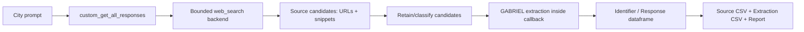

# City-by-City Public-Source Discovery and Extraction with a Custom GABRIEL Web-Search Callback

**Date:** 2026-07-01  
**Status:** Thursday-facing draft; seed/dry-run scaffold only

## 1. Executive summary

- No built-in local GABRIEL web-search function was found in this repo; the existing local runners operate on already assembled text inputs.
- We implemented a custom `get_all_responses_fn` scaffold, `custom_get_all_responses`, as the narrowest integration point for city-by-city public-source discovery plus extraction.
- The scaffold currently runs in seed/dry-run mode only; no live web search was executed and no ingestion was performed.
- The hook returns GABRIEL-compatible pandas output with `Identifier` and `Response`, where `Response` is always parseable JSON.
- Live mode only needs a backend adapter that matches the proposed `web_search` contract and returns a small set of standard source fields.
- The intended use is acquisition and extraction assistance for later manual review, not production measurement, not automated ingestion, and not causal inference.

### What we built

- A custom GABRIEL callback scaffold through `custom_get_all_responses`.
- A proposed live `web_search` backend contract with bounded, adapter-friendly inputs and outputs.
- A five-city seed harness covering Boston, Somerville, Newton, Wayland, and Seekonk.
- Two working output schemas: source discovery and evidence extraction.
- No live search and no ingestion yet.

### What this is / what this is not

- This is an acquisition/extraction assistant scaffold.
- This is not production measurement.
- This is not automatic ingestion.
- This is not causal evidence.
- This is not broad scraping.

## 2. Motivation

For the police/fire wage project, a central operational bottleneck is finding public, reasoning-rich municipal labor sources city by city. Final CBAs are often easy to locate relative to the documents that explain why wages moved: arbitration awards, JLMC materials, bargaining packets, mediation proposals, committee presentations, and union summaries.

That bottleneck matters because the project is trying to recover wage-setting mechanisms rather than simply stockpile contracts. A bounded GABRIEL web-search workflow could help discover candidate sources, classify them into the correct corpus lane, and extract short structured evidence before any later manual ingestion decision.

The value proposition is therefore upstream of production measurement. The scaffold is meant to assist acquisition and evidence triage, not to substitute for provenance review or the existing ingestion pipeline.

## 3. What the toolkit creator asked us to test

The Thursday task was not generic search. It was a specific test of whether GABRIEL could support a Massachusetts city-by-city workflow that does all of the following in one bounded pass:

- discover public sources by city;
- pull multiple structured attributes for each retained source;
- extract short evidence from sources, not just URLs;
- support search/discovery, source classification, and evidence extraction together.

In other words, the question was whether GABRIEL could act as a small acquisition-and-extraction assistant rather than only a scorer over already-local text.

## 4. What we found locally

Local inspection pointed to a clear gap:

- no built-in local GABRIEL web-search function was present;
- the existing local runners score already assembled text inputs and write results;
- the `ingest/fetchers/` layer is source-specific scaffolding for open portals, not a generic GABRIEL search interface;
- no local function accepted city/query input and returned ranked URLs, snippets, or extraction-ready search results.

That meant the relevant extension point was not an existing search utility. It was the tutorial-style custom callback boundary:

`get_all_responses_fn = custom_get_all_responses`

We therefore implemented the scaffold at that boundary rather than trying to repurpose ingestion code or overstate what the local repo already supports.

## 5. Custom callback design

The implemented hook is:

```python
custom_get_all_responses(
    prompts,
    identifiers,
    json_mode=False,
    model=None,
    api_key=None,
    web_search=None,
    **kwargs,
)
```

The design goal was narrow compatibility. The function accepts a batch of prompts and identifiers, resolves each city, and returns a pandas dataframe with exactly two columns:

- `Identifier`
- `Response`

`Response` is always a parseable JSON string. That is true even if `json_mode=False`, because the downstream requirement here is reliable flattening and auditability, not multiple response modes.

In seed/dry-run mode, the callback reads the existing five-city seed source and extraction CSVs, packages the city-level results into JSON payloads, and returns one payload per city. Each payload also carries:

- `status`
- `error_type`
- `error_message`
- `source_candidates`
- `extractions`
- `web_search_contract`
- `search_config`
- `notes`

This makes the callback self-describing enough for a Thursday discussion without requiring anyone to read the implementation first.

### Worked example payload

Below is the short form of one seeded Boston response. It shows the shape of the callback output without pasting the full payload.

```json
{
  "Identifier": "gabriel_websearch_city_boston_2026_06_30",
  "city": "Boston",
  "status": "seed_dry_run",
  "source_candidates_count": 3,
  "extractions_count": 7,
  "example_source_candidate": {
    "source_title": "BTU contract negotiations page",
    "source_url": "https://www.bostonpublicschools.org/school-committee/btu-contract-negotiations",
    "document_type_guess": "bargaining_update",
    "source_corpus_recommendation": "mechanism_proxy",
    "comparability_signal": "high"
  },
  "example_extraction": {
    "attribute": "comparability_emphasis",
    "attribute_signal": "high",
    "short_verbatim_excerpt": "Minimum and Maximum Teacher Salary with a Masters Comparisons to Surrounding Districts",
    "ingestion_recommendation": "add_to_mechanism_queue"
  },
  "notes": [
    "Seeded from existing calibration CSVs; live web search was not executed.",
    "Response is always a parseable JSON string regardless of json_mode."
  ]
}
```

## 6. Proposed live web-search backend contract

The scaffold assumes a deliberately small backend contract:

```python
web_search(
    query: str,
    *,
    max_results: int = 5,
    domains: list[str] | None = None,
    city: str | None = None,
    state: str | None = None,
) -> list[dict]
```

Expected result keys:

- `title`
- `url`
- `snippet`
- `source_domain`
- `published_date`
- `retrieval_status`

This contract is intentionally minimal and adapter-friendly. It does not assume a specific search vendor, ranking protocol, or page-fetch model. It only assumes that a backend can return a bounded list of source candidates with enough provenance to support retention decisions and later extraction.

That minimalism is deliberate for three reasons:

1. It keeps the integration surface small.
2. It preserves URLs and citation-bearing metadata from the start.
3. It avoids coupling the callback to any one backend's richer but potentially unstable object shape.

## 7. Pipeline diagram



## 8. Design choices made independently

These choices were made conservatively to optimize for auditability, token efficiency, provenance, city-by-city scaling, and no accidental ingestion.

| Design choice | Decision | Reason |
| --- | --- | --- |
| backend contract | Small `web_search(query, *, max_results, domains, city, state) -> list[dict]` contract | Keeps the adapter surface narrow and avoids hard-coding a vendor-specific response schema |
| returned search fields | `title`, `url`, `snippet`, `source_domain`, `published_date`, `retrieval_status` | Preserves enough discovery metadata for ranking, provenance, and later review without over-assuming backend richness |
| domain filters | Exposed per city and treated as hard preferences | Prioritizes official municipal, school, union, and state sources and reduces noisy search spread |
| result caps | Bounded queries, results, retained sources, and extractions | Controls token use and makes city-by-city review feasible |
| extraction inside callback | Conceptually yes | Keeps discovery and extraction within one GABRIEL-compatible hook boundary |
| always JSON response | Yes | Ensures reliable flattening back into tables and avoids mixed response formats |
| no streaming | Yes | The current hook boundary returns a complete dataframe; partial transport is unnecessary for the seed demo |
| no retries | Yes | Makes failures explicit and auditable rather than silently mutating search behavior |
| citation/source URL preservation | Preserve URLs and snippets in payloads | Prevents detached evidence and keeps source provenance inspectable |
| corpus-lane separation | Keep causal, mechanism-proxy, discourse, and lead-only distinct | Avoids accidental ingestion logic and protects the repo's two-corpus discipline |

## 9. Source and extraction schema

The scaffold is built around two compact outputs:

- a source-discovery CSV for retained candidates;
- an evidence-extraction CSV for short structured observations from those candidates.

| Artifact | Purpose | Unit of observation | Key columns | Use |
| --- | --- | --- | --- | --- |
| source-discovery CSV | Retain and classify public source candidates | one retained source candidate | `city`, `query`, `source_title`, `source_url`, `document_type_guess`, `source_corpus_recommendation`, `download_or_ingest_recommendation` | Acquisition triage, corpus-lane classification, later manual follow-up |
| evidence-extraction CSV | Record short source-level evidence on mechanism attributes | one extracted attribute observation | `city`, `source_title`, `attribute`, `attribute_signal`, `short_verbatim_excerpt`, `ingestion_recommendation` | Calibration, attribute testing, manual evidence review before any ingestion task |

The important design point is that these are not production corpus tables. They are search-and-extraction working tables that sit upstream of manual ingestion decisions.

## 10. Five-city seed demo

The current seed demo uses existing materials only. It is a dry-run harness, not a live search pilot.

- Cities: Boston, Somerville, Newton, Wayland, Seekonk
- City responses: 5
- Source candidates: 15
- Extraction rows: 34
- Live search executed: no
- Ingestion performed: no

| City | Source rows | Extraction rows | Calibration role |
| --- | ---: | ---: | --- |
| Boston | 3 | 7 | Non-safety peer-wage mechanism-proxy check |
| Somerville | 3 | 8 | Safety arbitration/JLMC positive calibration |
| Newton | 3 | 7 | Mediation and MOA edge-case review |
| Wayland | 3 | 6 | JLMC positive plus grievance-arbitration exclusion |
| Seekonk | 3 | 6 | Clean official archive ingestability check |

## 11. Calibration examples

- Boston BTU: useful non-safety peer-wage mechanism-proxy example with high comparability and named comparator signal; not v10 impasse evidence.
- Somerville police awards: clear safety-side calibration positives for arbitration/JLMC and comparability.
- Wayland fire JLMC: positive impasse/arbitration pathway example through a stipulated award.
- Seekonk official CBA archive: clean official-source ingestability example and a useful ordinary CBA comparison case.
- Newton materials: mostly mechanism-proxy or manual-review leads rather than clean final causal documents.

These examples are useful because they define both positive cases and exclusion boundaries before any live test.

## 12. Multiple attributes extracted

- `comparability_emphasis`: whether the source explicitly compares wages or compensation to peer jurisdictions; this matters because comparability is the main candidate ratchet mechanism.
- `arbitration_or_impasse_backstop`: whether the source shows formal impasse-resolution institutions shaping settlement; this matters because safety wage-setting may depend on stronger backstop institutions.
- `wage_reasoning_density`: whether the source explains why wages changed rather than only listing terms; this matters because reasoning-rich documents are more analytically valuable than bare agreements.
- `named_comparator_signal`: whether the source names specific comparator cities or districts; this matters because named peers are stronger mechanism evidence than generic market language.
- `source_ingestability`: whether the source is a clean public final document that could later enter the causal pipeline; this matters because many useful search leads are still not ingestion-ready.

## 13. Guardrails

The scaffold is intentionally constrained.

- No automatic ingestion.
- No PRRs.
- No paywalled or licensed sources.
- No broad scraping.
- No causal claims.
- No merging mechanism-proxy or discourse leads into the causal corpus.
- No treating ordinary grievance arbitration as impasse evidence.
- No treating peer-wage comparison alone as arbitration/impasse evidence.

Those guardrails matter because the acquisition layer should widen source visibility without collapsing the repo's provenance and corpus-separation discipline.

## 14. Adapter-fit points for Thursday

We chose conservative defaults so the scaffold is easy to explain and easy to adapt. If the toolkit backend differs, the likely outcome is contract adjustment, not redesign. The questions below are therefore about optimizing integration rather than proving feasibility.

- Does the backend already match the proposed `web_search` signature?
- What fields does it actually return?
- Does it return page text, snippets, or both?
- Can it preserve citations and source URLs cleanly?
- Does JSON mode behave well when searched content is involved?
- Should extraction run inside the callback or in a second GABRIEL pass?
- What are the rate limits?
- Is there an official error-object format?

The scaffold already demonstrates a workable integration shape. Thursday should help determine how closely the current backend matches that shape and where a thin adapter would be useful.

## 15. Next live-test plan

If a safe backend becomes available, the first live test should remain tightly bounded:

- use the same five cities;
- keep domain filters on;
- run at most six queries per city;
- return at most five results per query;
- retain at most ten sources per city;
- extract at most three spans per source;
- compare live outputs against the seed calibration rows;
- do not ingest anything without a later manual task.

That bounded plan is enough to test source recovery, lane classification, and attribute extraction without drifting into production collection.

## 16. Bottom-line recommendation

The scaffold is useful as an acquisition-and-extraction assistant. The seeded harness is ready now. The next step is backend adapter confirmation followed by a bounded live five-city test. Production measurement should wait until live search outputs are manually reviewed and provenance-preserving.

## 17. Thursday decision points

- Confirm or revise the proposed backend contract.
- Decide whether extraction should happen inside the callback or as a second GABRIEL pass.
- Decide whether the live backend should return snippets only, page text, or both.
- Agree on first live five-city test constraints and caps.
- Agree that ingestion remains a separate manual step.
