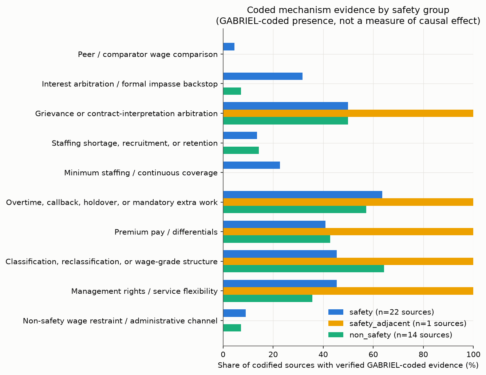
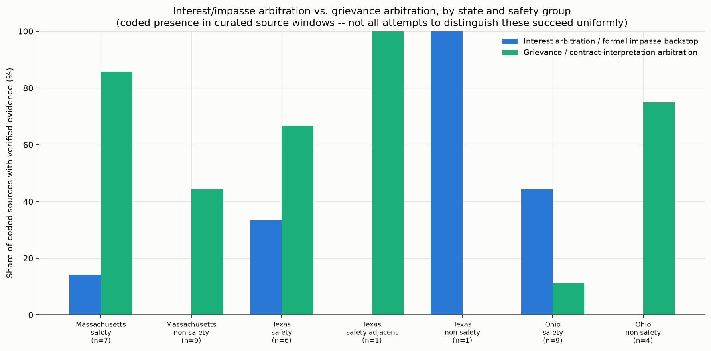
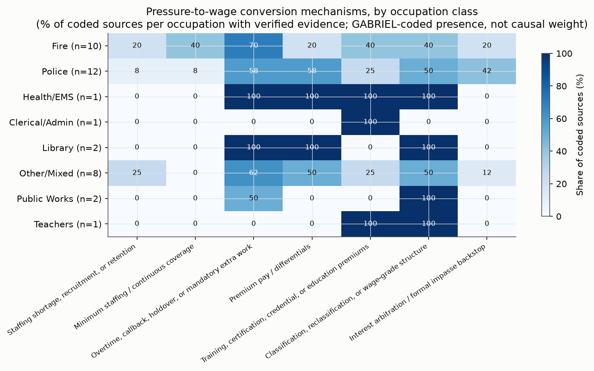
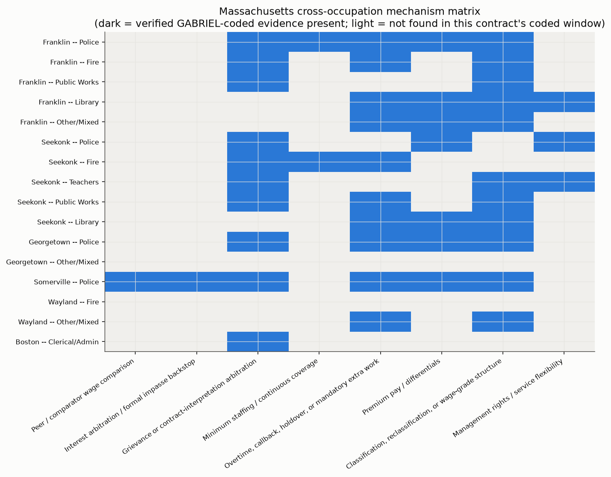
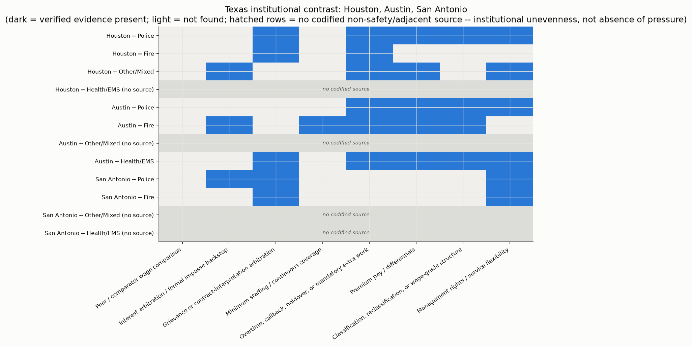
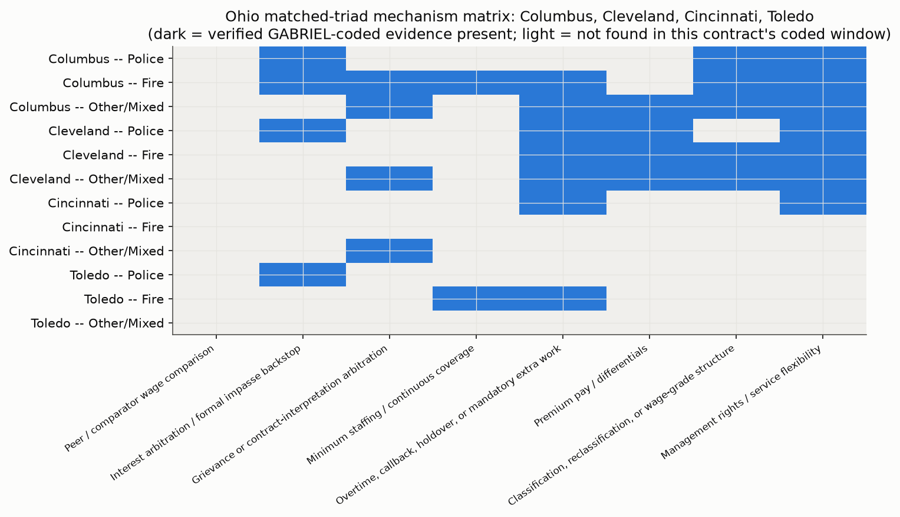

# Deeper Look Into Safety & Non-safety Wage Mechanisms

**Subtitle:** Mechanisms, Counterpoints, and Source Needs Across Municipal Occupations
**Header/report label:** Safety & Non-safety Wage Mechanisms

**Status: DRAFT SCAFFOLD for human review.** Markdown, CSV tables, and charts only — no PDF/DOCX has been produced. This document is the input to a formatting run, not the final artifact.

---

## Executive Summary

- **This report analyzes GABRIEL-coded evidence patterns, not causal estimates**, drawn from 37 codified municipal labor agreements across Massachusetts, Texas, and Ohio — 284 verified "present" findings across 19 wage-mechanism attributes (out of 293 coded present before verification; see Method).
- It compares **safety** (police, fire), **safety-adjacent** (EMS/nurse-health), and **non-safety** (teachers, public works, library, clerical/admin, and broad "other" municipal units) sources on the same coded attributes.
- **The evidence supports a mechanism story, not proof of a causal wage effect.** Codify records whether specific mechanism language appears in a curated source excerpt — it does not measure how much any mechanism moved a wage outcome, and a mechanism coded absent may simply not have been captured in this pass's excerpts rather than genuinely missing from the contract.
- **Police/fire sources more often show formal impasse/interest-arbitration backstops, staffing/coverage obligations, and overtime/premium-pay architecture** than non-safety sources coded so far — though the margins are moderate for several attributes, and grievance arbitration itself is common across both groups.
- **Non-safety sources most often show classification/wage-grade structure, benefits/total compensation, and management-rights language** — a different channel for converting pressure into pay, not evidence that pressure is absent.
- **Ohio has the cleanest matched triads** in this corpus (Columbus, Cleveland, Cincinnati, Toledo — each with a codified police, fire, and non-safety row under one statutory framework, ORC Chapter 4117); **Texas remains institutionally uneven** (only Houston has a genuine non-safety codified source); **Massachusetts offers the densest cross-occupation comparison** (Franklin and Seekonk each span five occupation classes within one city and cycle window).

## Scope and Data

- **Corpus:** `data/contracts.csv` has 53 rows across Massachusetts (32), Texas (8), and Ohio (13), spanning 16 distinct cities.
- **Codified subset:** 37 of those 53 contracts have been run through GABRIEL/codify as of this report (all 8 Texas contracts, all 13 Ohio contracts, 16 of 32 Massachusetts contracts). This report covers only the codified subset — it does not infer mechanism presence from uncodified source text.
- **States/cities covered:** Massachusetts (Boston, Franklin, Georgetown, Seekonk, Somerville, Wayland); Texas (Austin, Houston, San Antonio); Ohio (Cincinnati, Cleveland, Columbus, Toledo).
- **Source types:** collective bargaining agreements (`cba`) and one arbitration award (`arbitration_award`, Houston fire) — all `source_corpus=causal` per this project's two-corpus rule; no discourse-corpus text is used in this report.
- **Only verified present evidence is used for graph claims and headline counts**: `evidence_status=present AND viewer_verified=1`. This is 284 of the evidence layer's 293 present rows.
- **9 flagged/unverified present rows are excluded from every headline count and every graph in this report** (they remain in the underlying evidence layer and the viewer's "Show unverified" toggle, but are not treated as evidence here). See `report_evidence_layer_audit_2026-07-10.md` for the full list and reasons.

## Method

**In plain terms:** GABRIEL's `codify()` function reads a short, curated excerpt from each contract and answers one yes/no question per wage-mechanism attribute — does this specific language appear in this excerpt, or not? It does not weigh, score, or interpret the language beyond that binary call. The full 19-attribute codebook, with plain-English labels and definitions, is in Appendix A; it covers arbitration and impasse mechanisms, staffing and overtime, pay differentials, classification, benefits, management rights, and several other wage-relevant channels.

Every `present` result is checked twice before this report treats it as evidence. First, an automated check confirms the excerpt is an exact substring of its source window — not paraphrased, not invented (`source_grounding_status=grounded`). Second, a review pass flags any excerpt that echoes this project's own codebook vocabulary or leaks across a window boundary, rather than trusting it silently. **"Verified present" — what "present," "found," or a filled cell means anywhere in this report unless a figure says otherwise — means a finding passed both checks.** 9 of the 293 coded-present findings failed the second check and are excluded from every count and figure here; see `report_evidence_layer_audit_2026-07-10.md` for the full list and reasons.

The durable evidence layer (`docs/analysis/gabriel_codify_evidence_layer.csv`, 781 rows spanning five codify batches — pilot, Texas/Ohio scale-up, Massachusetts, Seekonk/Wayland, and expanded Texas/Ohio) backs every table and figure in this report. The companion viewer (`docs/analysis/gabriel_codify_excerpt_browser_latest.html`) lets a reader browse every coded excerpt directly, filtered by state, city, occupation, and mechanism, with unverified rows hidden by default.

**Limitations of the method itself:** codify is a binary presence detector operating over hand-curated excerpt windows, not full documents — a `not_found` result can mean the mechanism is genuinely absent from the contract, or simply that this pass's excerpt selection did not happen to include it. A few sources are OCR-recovered and text quality varies. None of this supports a causal wage estimate on its own.

## Headline Finding

The emerging pattern is not that public-safety work is simply "hard" and non-safety work is "easy." Rather, **safety wage pressure appears more likely to be paired with institutional channels that convert pressure into wage-setting claims**: formal impasse procedures, staffing/coverage obligations, overtime and premium-pay structures, and bargaining institutions with statutory teeth. **Non-safety wage pressure appears more often routed through classification, grades, management rights, and administrative channels** — different conversion machinery, not necessarily less real pressure underneath it.

## Mechanism Evidence Patterns

Across all 37 codified sources, the most frequently verified mechanisms overall are **overtime/callback/holdover** (23 of 37 sources, 62%), **classification/reclassification/grade structure** (20 of 37, 54%), **grievance/contract-interpretation arbitration** (19 of 37, 51%), **benefits/total compensation** and **union security** (18 of 37 each, 49%), and **management rights** and **premium pay** (16 of 37 each, 43%). These are broadly present channels — not distinctive to one occupation group — and any report claim about "what makes safety different" should be read against this shared baseline, not in isolation from it.

**Peer/comparator wage comparison** is the corpus's rarest verified attribute (1 of 37 sources) — almost certainly an under-coding artifact rather than a genuine absence: this project's own audit of the most recent codify batch documents a specific, observed false negative on San Antonio police, whose window contains explicit factfinding-panel language directing comparison to "comparable cities in the State of Texas" that the model did not flag (see `gabriel_codify_expanded_texas_ohio_audit_2026-07-10.md`). Somerville's police JLMC arbitration award independently documents comparator language in its excerpt ("wages and benefits of comparable towns" as a statutory arbitration criterion) but that specific excerpt did not pass this run's stricter verified-present filter for this table. Readers should not conclude that peer-comparator wage logic is rare in practice — only that this codify pass under-detected it.

**Interest/formal-impasse arbitration vs. grievance arbitration.** The codebook was specifically refined to keep these two mechanisms distinct — one governs *how new wage terms get set at impasse*, the other governs *disputes under an existing agreement*. San Antonio police is this corpus's cleanest single-document test: the same contract's coded text distinguishes its Chapter 174 "Section 4. Impasse Procedure" ("the parties shall abide by the impasse procedure set forth in City Ordinance No. 51838...") from its separate Article 15 grievance-arbitration mechanism ("Section 4. Arbitration. If a grievance is submitted to arbitration...the decision of the arbitrator shall be final and binding"). Somerville police's JLMC award independently confirms interest arbitration is used "when there is an exhaustion of the process of collective bargaining which constitutes a potential threat to public welfare" — the Massachusetts-specific compulsory-arbitration backstop this project's earlier scoping work identified as JLMC's defining feature.

**Staffing/recruitment/retention and minimum-staffing/continuous-coverage** are coded present in a minority of sources so far (5 of 37 each) — both are narrower, harder-to-detect claims (an explicit shortage/vacancy statement, or an explicit crew-size/coverage obligation) than the broader overtime or classification attributes, and likely undercount true prevalence for the same reason as peer-comparator language.

**Overtime/callback/holdover and premium pay** are common across both safety and non-safety sources (see the pressure-conversion heatmap below) — the institutional *form* differs (police/fire callback and standby-pay architecture vs. DPW storm/overtime incentive programs) but the underlying mechanism (extra-duty compensation) recurs across occupation groups.

**Classification/reclassification and grade structure** is, if anything, *more* common among non-safety sources coded so far (64% of non-safety sources vs. 45% of safety sources) — consistent with this project's standing hypothesis that non-safety wage pressure often gets absorbed into step/grade architecture rather than routed through arbitration.

**Management rights** shows the widest state-level spread of any attribute examined (19% of Massachusetts sources vs. 75% of Texas sources) — likely reflecting real drafting-convention differences across states' CBA templates rather than a substantive institutional difference; this is flagged as a caveat, not a finding, until confirmed against a larger Texas non-safety sample.

**Union security/institutional power** and **civil-service/statutory employment channel** are both broadly present (49% and 38% of all sources respectively) and track each state's own legal architecture closely — Ohio sources cite ORC 4117.08(C) management-rights language directly ("the City of Cincinnati retains the following management rights as set forth in Ohio Revised Code Section 4117.08(C)..."), a pattern repeated near-verbatim across all four codified Ohio cities.

**Budget/fiscal-constraint** and **non-safety wage-restraint/administrative-channel** language are both rare as verified evidence (2 and 3 of 37 sources respectively) — these are among the hardest attributes to detect from a short curated excerpt, since they typically require broader budget-document context this project's CBA-only corpus does not capture.

## State Findings

### Massachusetts

Massachusetts is this corpus's **densest cross-occupation laboratory**. Franklin and Seekonk each span five occupation classes within one city and overlapping cycle window (police, fire, plus three non-safety groups apiece), giving the report its most direct same-city, same-period safety-vs-non-safety comparisons. Somerville's police arbitration award is the corpus's clearest interest-arbitration document, reasoning explicitly through the "potential threat to public welfare" standard, and Wayland — including OCR-recovered fire and civilian/dispatch content — is this corpus's most mechanism-rich single city for testing the safety/civilian-adjacent boundary. Across Massachusetts, non-safety sources (Boston, Franklin, Seekonk, Georgetown) most often show classification and administrative-channel language rather than arbitration language — consistent with this project's standing finding that none of Massachusetts's non-safety occupation groups has JLMC-equivalent compulsory interest arbitration.

### Texas

**Houston is Texas's only fully matched city** in this codified set — police, fire (an arbitration award, not a base CBA), and a genuine non-safety row (HOPE/AFSCME Local 123). **Austin's comparison runs through EMS**, not an ordinary civilian/clerical unit — Austin EMS is civil-service-protected and statutorily adjacent to police/fire, a caveat that must travel with any Austin-EMS finding rather than being generalized to "Texas non-safety." **San Antonio contributes police/fire institutional contrast only**, not a third matched triad: it was added specifically to test whether Houston's population-triggered compulsory-arbitration exception generalizes, and no non-safety bargaining channel was confirmed to exist for it. Texas's mechanism profile should be read with real caution: the "Texas non-safety" and "Texas safety-adjacent" bars in this report's charts each represent a single source (Houston HOPE; Austin EMS), so any 0%/100% reading is a small-sample artifact, not a robust state-level finding.

### Ohio

**Ohio is the strongest state for matched-triad design** after this project's Texas/Ohio expansion: Columbus, Cleveland, Cincinnati, and Toledo each have a codified police, fire, and non-safety ("other") row, all operating under the same statewide statutory framework (Ohio Revised Code Chapter 4117 / SERB), which several codified sources cite directly and near-identically. This uniformity is itself informative — it means observed differences across these four cities are less likely to reflect different underlying labor law and more likely to reflect genuine city-to-city or document-to-document variation. Where coded, Ohio sources distinguish grievance arbitration (common across police, fire, and non-safety rows) from narrower, issue-specific interest-arbitration reopener clauses (e.g., Toledo's health-insurance-cost reopener, distinct from a general successor-agreement backstop) — consistent with this corpus's broader finding that interest/impasse arbitration and grievance arbitration are genuinely distinct mechanisms, not merely relabeled versions of each other.

## What Appears to Drive the Wage Gap?

This report does not claim a single leading cause. **The strongest evidence pattern is that safety wage-setting combines occupational pressure with stronger conversion channels** — several interacting mechanisms, not one:

1. **Formal impasse/arbitration backstops.** Where coded, interest/impasse arbitration appears more concentrated in safety and safety-adjacent sources than in non-safety sources (32% of safety sources vs. 7% of non-safety sources coded present) — a channel that gives safety bargaining a statutory route to a binding outcome that most non-safety units in this corpus lack.
2. **Staffing and continuous-coverage pressure.** Minimum-staffing and coverage-obligation language, though rare as verified evidence overall, appears exclusively in safety sources so far (23% of safety sources, 0% of non-safety or safety-adjacent sources coded present) — consistent with round-the-clock coverage obligations that most non-safety occupations in this corpus do not carry.
3. **Overtime/premium-pay architecture.** Present broadly, but somewhat more concentrated in safety sources (64% vs. 57% of non-safety sources) — a difference of degree, not kind.
4. **Peer/comparator wage logic in arbitration/factfinding contexts.** Likely under-detected by this codify pass (see above), but where captured (Somerville, San Antonio), comparator language appears embedded specifically within formal impasse/factfinding procedures — suggesting this mechanism may travel together with interest arbitration rather than standing alone.
5. **Non-safety routing through classification/administrative channels.** Non-safety sources show classification/grade-structure language at a higher rate than safety sources (64% vs. 45%) — a materially different, not simply weaker, wage-conversion path.

## Counterpoints and Non-safety Pressures

- Non-safety workers in this corpus's own sources face **real staffing, classification, wage-grade, and service-delivery pressure** — DPW storm-response overtime incentive programs (Arlington, Seekonk, Franklin, documented in this project's earlier DPW-focused sessions), library and clerical classification schedules, and teacher step-and-lane structures are not evidence of an absence of pressure, only of a different pressure-to-wage pathway.
- Some non-safety units carry **strong union-security and management-rights provisions** of their own — Cincinnati's CODE unit and Toledo's AFSCME Local 2058 both show verified union-security and no-strike language at rates comparable to their cities' safety counterparts.
- **The difference this report documents is not "pressure vs. no pressure" — it is which institutional channel converts pressure into a wage claim.** Classification and administrative channels can and do produce wage gains (step advancement, grade reclassification, compensation studies); they appear structurally different from arbitration-backstopped bargaining, not necessarily weaker in dollar terms — this report's binary present/not_found evidence cannot compare magnitudes.
- The rarity of coded `non_safety_wage_restraint_or_admin_channel` evidence (3 of 37 sources) should not be read as evidence that non-safety wage-setting is rarely constrained administratively — it more likely reflects that this specific claim (wages routed through consultation/administrative processes *instead of* ordinary bargaining) requires broader context than a short CBA excerpt typically contains.

## Source Needs and Next-State Strategy

Selection logic for any future state expansion should weigh:

- **Institutional contrast** — does the candidate state's public-safety bargaining law differ meaningfully from Massachusetts (JLMC), Texas (Chapter 174/142/146, population-gated), and Ohio (statewide ORC 4117/SERB)?
- **Source availability** — are CBAs/awards publicly downloadable, or does the state require FOIA/licensed-database access (out of scope for this project's public-download-only ingestion path)?
- **Matched-city triad potential** — can a state supply at least one city with police, fire, *and* a genuine non-safety bargaining channel, avoiding the Texas non-safety-coverage problem?
- **Arbitration/impasse variation** — does the candidate add a genuinely different impasse-resolution design (e.g., mandatory interest arbitration triggered differently, or no compulsory mechanism at all)?
- **Public-sector bargaining law variation** — including states where bargaining rights are narrower or absent, which would itself be an informative institutional contrast rather than a data gap to avoid.
- **Non-safety availability specifically** — this report's Texas experience shows that safety sources are consistently easier to locate publicly than non-safety sources; any next-state plan should scope non-safety availability *before* committing acquisition effort.

**Provisional candidate states** (not a final decision — see below):

- **New York** — rich municipal bargaining activity, but source volume and public-access consistency across NY's many home-rule municipalities is a real practical challenge.
- **New Jersey** — genuine interest-arbitration relevance (a real institutional-design contrast case) and generally comparable municipal-bargaining structure to test generalizability.
- **Pennsylvania** — Act 111 gives a clean public-safety-arbitration contrast case, with potential non-safety comparison sources also available.
- **Illinois** — large city and suburban source availability, with real bargaining-law variation across jurisdictions.
- **California** — strong bargaining institutions and generally good source availability, but the state's own bargaining landscape may be broad/complex enough to need its own dedicated scoping pass.
- **Florida, North Carolina, or Tennessee** — useful *weak-bargaining-channel* contrast states (right-to-work / limited public-sector bargaining rights in several of these), valuable specifically because they differ so much from the three states already in this corpus, if source availability supports a real comparison.

**This is not a final recommendation.** Per this project's own standing practice, any next-state work should begin with a dedicated source-availability scan (mirroring the `texas_ohio_multicity_pre_ingestion_scan_2026-07-08.md` precedent) before any acquisition effort is authorized.

## Report Limitations

- **GABRIEL/codify is a binary presence detector**, not a strength, frequency, or dollar-magnitude measurement — every finding in this report is "was this language coded present," not "how much did this mechanism matter."
- **Source windows are curated**, not full documents — a `not_found` result can reflect either genuine absence or an excerpt-selection gap; this report cannot distinguish the two without re-reading full source text.
- **Not all possible mechanisms are captured in every source** — the 19-attribute codebook is this project's own construction and may not exhaustively cover every wage-relevant clause type in every document.
- **Text quality varies** — several sources are OCR-recovered (San Antonio police, Wayland's dispatch/nurse content, others) and carry a documented risk of minor extraction error, distinct from the fabrication risk this project's grounding checks specifically guard against.
- **9 flagged/unverified present rows are excluded from every headline count and graph in this report** — they remain visible in the underlying evidence layer and viewer, not deleted, but are not treated as evidence here.
- **Texas non-safety evidence remains limited** — a single genuine non-safety source (Houston HOPE) and a single safety-adjacent source (Austin EMS) support every Texas non-safety/adjacent claim in this report; these should be read as illustrative, not representative.
- **Results are evidence patterns, not causal estimates.** Nothing in this report should be read as measuring the size of any wage effect, isolating one mechanism's contribution from another's, or ruling out confounding factors (city fiscal capacity, local labor-market conditions, political salience) this project has not yet measured.

## Appendix

See `docs/analysis/report_appendix_tables_2026-07-10.md` for:
- the full 19-attribute glossary with plain-English labels and definitions;
- the source inventory table (all 37 codified contracts, one row each);
- the complete list of report tables and figures generated this run;
- notes on how to open and use the interactive viewer.

**Viewer path:** `docs/analysis/gabriel_codify_excerpt_browser_latest.html` — open directly in a browser to explore every coded excerpt behind this report's tables and figures, including the 9 flagged/unverified rows this report excludes (visible via the viewer's "Show unverified / unsupported evidence" toggle).
